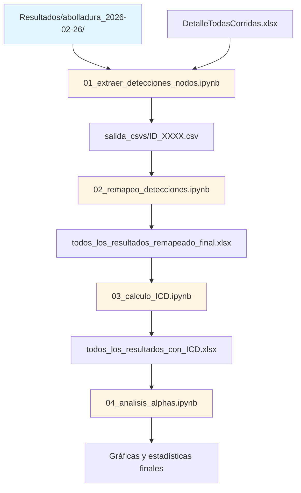

# Pipeline de Análisis de Resultados 2026

**Fecha de creación:** 2 de marzo de 2026  
**Simulaciones procesadas:** 3,240 corridas (1,080 abolladuras + 2,160 corrosión)  
**Objetivo:** Análisis completo con ICD y vectores alpha para cumplir Puntos 2.5-2.6 del paper

---

## 📋 Índice

1. [Descripción General](#descripción-general)
2. [Estructura de Archivos](#estructura-de-archivos)
3. [Flujo de Trabajo](#flujo-de-trabajo)
4. [Notebooks y Ejecución](#notebooks-y-ejecución)
5. [Datos de Entrada](#datos-de-entrada)
6. [Datos de Salida](#datos-de-salida)
7. [Diferencias vs Pipeline Antiguo](#diferencias-vs-pipeline-antiguo)

---

## 🎯 Descripción General

Este pipeline procesa los resultados de las simulaciones ejecutadas el fin de semana del 26-27 de febrero de 2026, que incluyen por primera vez los **vectores alpha (α₁-α₈)** exportados por el Algoritmo Genético.

**Objetivos del análisis:**
1. Extraer detecciones nodales desde `DetalleTodasCorridas.xlsx`
2. Aplicar remapeo 0.5 (detección indirecta vía nodos cercanos)
3. Calcular Índice de Calidad de Detección (ICD)
4. Analizar distribución e influencia de vectores alpha
5. Identificar DIs más relevantes para detección de daños

---

## 📂 Estructura de Archivos

```
outputs/resultados_nuevos/
├── README.md                                   # Este archivo
├── nodos_beams.csv                             # Mapeo beams → nodos cercanos
├── nodos_inclined_legs.csv                     # Mapeo inclined_legs → nodos cercanos
│
├── 01_extraer_detecciones_nodos.ipynb          # Notebook 1: Extracción Excel → CSVs
├── 02_remapeo_detecciones.ipynb                # Notebook 2: Remapeo 0.5
├── 03_calculo_ICD.ipynb                        # Notebook 3: Cálculo ICD
├── 04_analisis_alphas.ipynb                    # Notebook 4: Análisis alphas
│
├── abolladuras_2026/
│   ├── salida_csvs/                            # 1,080 CSVs con detecciones nodales
│   │   ├── ID_0001.csv
│   │   ├── ID_0002.csv
│   │   └── ... (1,080 archivos)
│   ├── todos_los_resultados_remapeado_beams.xlsx
│   ├── todos_los_resultados_remapeado_final.xlsx
│   ├── todos_los_resultados_con_ICD_abolladura.xlsx
│   └── *.png                                   # Gráficas generadas
│
└── corrosion_2026/
    ├── salida_csvs/                            # 2,160 CSVs con detecciones nodales
    │   ├── ID_0001.csv
    │   ├── ID_0002.csv
    │   └── ... (2,160 archivos)
    ├── todos_los_resultados_remapeado_beams.xlsx
    ├── todos_los_resultados_remapeado_final.xlsx
    ├── todos_los_resultados_con_ICD_corrosion.xlsx
    └── *.png                                   # Gráficas generadas
```

---

## 🔄 Flujo de Trabajo



---

## 📓 Notebooks y Ejecución

### Notebook 1: `01_extraer_detecciones_nodos.ipynb`

**Objetivo:** Convertir hojas de `DetalleTodasCorridas.xlsx` a archivos CSV individuales.

**Entrada:**
- `Resultados/abolladura_2026-02-26_05-26-02/DetalleTodasCorridas.xlsx`
- `Resultados/corrosion_2026-02-27_06-07-17/DetalleTodasCorridas.xlsx`

**Salida:**
- `abolladuras_2026/salida_csvs/ID_0001.csv` ... `ID_1080.csv`
- `corrosion_2026/salida_csvs/ID_0001.csv` ... `ID_2160.csv`

**Formato de cada CSV:**
```csv
Numero_de_nodo,Valor_de_daño_normalizado,Estado
5,99.988311,Daño
6,80.878867,Daño
7,5.234567,-
...
```

**Ejecución:**
```bash
# Ejecutar todas las celdas
jupyter nbconvert --to notebook --execute 01_extraer_detecciones_nodos.ipynb
```

---

### Notebook 2: `02_remapeo_detecciones.ipynb`

**Objetivo:** Aplicar remapeo 0.5 para beams e inclined_legs cuando el AG detecta nodos cercanos.

**Entrada:**
- `Resultados/.../todos_los_resultados.xlsx` (original con alphas)
- `salida_csvs/ID_XXXX.csv` (detecciones nodales)
- `nodos_beams.csv` (mapeo elemento → nodos)
- `nodos_inclined_legs.csv` (mapeo elemento → nodos)

**Salida:**
- `todos_los_resultados_remapeado_beams.xlsx` (etapa intermedia)
- `todos_los_resultados_remapeado_final.xlsx` (etapa final)

**Lógica del remapeo:**
- Si `Elemento ∈ {beams, inclined_legs}` Y `DeteccionOK == 0`:
  - Verificar si `nodo_cercano_1` o `nodo_cercano_2` tienen `Estado == "Daño"` en el CSV correspondiente
  - Si SÍ → Cambiar `DeteccionOK` de `0` a `0.5`

**Configuración:**
```python
# En celda 2 del notebook:
TIPO_DANO = 'abolladura'  # o 'corrosion'
```

**Ejecución:**
```bash
# Abolladuras
jupyter nbconvert --to notebook --execute 02_remapeo_detecciones.ipynb

# Corrosión (modificar TIPO_DANO en el notebook antes de ejecutar)
```

---

### Notebook 3: `03_calculo_ICD.ipynb`

**Objetivo:** Calcular el Índice de Calidad de Detección (ICD).

**Fórmula:**
$$
\text{ICD} = \text{DetOK} \times \frac{\ln(1 + \alpha \times \%)}{\ln(1 + \alpha \times \%_{\max})} \times e^{-\beta \times N_{\text{FP}}}
$$

**Parámetros:**
- `α = 0.1` (factor de confianza)
- `β = 0.15` (factor de penalización)
- `%_max = 45%` (abolladuras) o `90%` (corrosión)

**Entrada:**
- `todos_los_resultados_remapeado_final.xlsx`

**Salida:**
- `todos_los_resultados_con_ICD_{tipo_dano}.xlsx`
- Gráficas: ICD vs severidad, distribuciones, comparación binario vs ICD

**Configuración:**
```python
# En celda 2 del notebook:
TIPO_DANO = 'abolladura'  # o 'corrosion'
```

**Ejecución:**
```bash
# Abolladuras
jupyter nbconvert --to notebook --execute 03_calculo_ICD.ipynb
```

---

### Notebook 4: `04_analisis_alphas.ipynb`

**Objetivo:** Análisis estadístico de vectores alpha (Punto 2.5-2.6 del paper).

**Análisis realizados:**
1. Verificación de normalización (Σα = 1)
2. Estadísticas descriptivas por DI (media, std, CV)
3. Boxplots de distribución
4. Evolución de alphas vs severidad
5. Matriz de correlación entre alphas
6. Correlación alpha-ICD
7. Análisis de estabilidad (coeficiente de variación)
8. Análisis por tipo de elemento

**Entrada:**
- `Resultados/.../todos_los_resultados.xlsx` (con columnas alpha1-alpha8)
- `todos_los_resultados_con_ICD_{tipo_dano}.xlsx` (opcional, para correlaciones)

**Salida:**
- Gráficas: boxplots, heatmaps, barras, líneas
- Tablas: estadísticas descriptivas, correlaciones, CV

**Configuración:**
```python
# En celda 2 del notebook:
TIPO_DANO = 'abolladura'  # o 'corrosion'
```

**Ejecución:**
```bash
# Abolladuras
jupyter nbconvert --to notebook --execute 04_analisis_alphas.ipynb
```

---

## 📥 Datos de Entrada

### Archivos originales (simulaciones 2026)

| Archivo | Ubicación | Descripción |
|---------|-----------|-------------|
| `todos_los_resultados.xlsx` | `Resultados/abolladura_2026-02-26_05-26-02/` | Resultados AG con alphas (1,080 filas) |
| `todos_los_resultados.xlsx` | `Resultados/corrosion_2026-02-27_06-07-17/` | Resultados AG con alphas (2,160 filas) |
| `DetalleTodasCorridas.xlsx` | `Resultados/abolladura_2026-02-26_05-26-02/` | Detecciones nodales (1,080 hojas) |
| `DetalleTodasCorridas.xlsx` | `Resultados/corrosion_2026-02-27_06-07-17/` | Detecciones nodales (2,160 hojas) |

### Estructura de `todos_los_resultados.xlsx`

**Columnas (18 total):**
- `ID`: Número de corrida (1-1080 o 1-2160)
- `Elemento`: Elemento con daño (1-120)
- `Porcentaje`: Severidad del daño (5-45% o 5-90%)
- `Tiempo_s`: Tiempo de ejecución del AG (segundos)
- `ObjFinal`: Valor final de la función objetivo
- `DeteccionOK`: Boolean (True/False → 1/0)
- `N_FalsosPositivos`: Número de falsos positivos
- **`alpha1` - `alpha8`**: Pesos asignados a cada DI (Σα = 1)
- `MAC_minimo`: MAC mínimo entre modos
- `MAC_promedio`: MAC promedio entre modos
- `Hubo_cruces_modales`: Boolean (True/False)

### Estructura de `DetalleTodasCorridas.xlsx`

**Hojas:** 1,080 hojas (abolladuras) o 2,160 hojas (corrosión)  
**Nombre de hojas:** `ID_0001`, `ID_0002`, ..., `ID_XXXX`

**Columnas por hoja:**
- `Numero_de_nodo`: ID del nodo (5-52, excluyendo 4 empotrados)
- `Valor_de_daño_normalizado`: Valor P_scaled (0-100%)
- `Estado`: `"Daño"` si ≥50%, `"-"` si <50%

---

## 📤 Datos de Salida

### Archivos intermedios

| Archivo | Descripción | Tamaño aprox. |
|---------|-------------|---------------|
| `salida_csvs/ID_XXXX.csv` | Detecciones nodales por corrida | 1,080 × 2 KB |
| `todos_los_resultados_remapeado_beams.xlsx` | Dataset con beams remapeados | ~500 KB |
| `todos_los_resultados_remapeado_final.xlsx` | Dataset con beams + legs remapeados | ~500 KB |

### Archivos finales

| Archivo | Descripción | Tamaño aprox. |
|---------|-------------|---------------|
| `todos_los_resultados_con_ICD_{tipo}.xlsx` | Dataset completo con ICD | ~600 KB |
| `*.png` | Gráficas de análisis (15-20 por tipo) | 300 KB c/u |

### Gráficas generadas (ejemplos)

**Notebook 3 (ICD):**
- `ICD_vs_severidad_{tipo}.png`
- `ICD_por_tipo_elemento_{tipo}.png`
- `distribuciones_componentes_ICD_{tipo}.png`
- `comparacion_binario_vs_ICD_{tipo}.png`

**Notebook 4 (Alphas):**
- `verificacion_normalizacion_alphas_{tipo}.png`
- `boxplot_alphas_por_DI_{tipo}.png`
- `alphas_vs_severidad_{tipo}.png`
- `correlacion_alphas_{tipo}.png` (heatmap)
- `correlacion_alphas_ICD_{tipo}.png`
- `estabilidad_alphas_CV_{tipo}.png`
- `alphas_por_tipo_elemento_{tipo}.png`

---

## 🔀 Diferencias vs Pipeline Antiguo

| Aspecto | Pipeline Antiguo | Pipeline Nuevo (2026) |
|---------|------------------|----------------------|
| **Vectores alpha** | ❌ NO exportados | ✅ SÍ exportados (alpha1-alpha8) |
| **Campos de dispersión** | ✅ PromDispersion, StdDispersion, MeanAbsDispersion | ❌ Eliminados (reemplazados por alphas) |
| **Detecciones nodales** | 📁 1,080 CSVs separados (`salida_csvs/`) | 📊 1 Excel con 1,080 hojas (`DetalleTodasCorridas.xlsx`) |
| **Hungarian Algorithm** | ❌ NO implementado | ✅ SÍ implementado (mejora matching modal) |
| **MAC_minimo, MAC_promedio** | ❌ NO registrados | ✅ SÍ registrados |
| **Hubo_cruces_modales** | ❌ NO registrado | ✅ SÍ registrado |
| **Número de columnas** | 12 | 18 |
| **Remapeo 0.5** | ✅ Aplicado (beams + legs) | ✅ Aplicado (misma lógica) |
| **ICD** | ✅ Calculado | ✅ Calculado (misma fórmula) |
| **Análisis de alphas** | ❌ NO disponible | ✅ Análisis completo (Punto 2.5-2.6) |

---

## 📊 Dependencias de Software

**Python 3.8+**
- `pandas >= 1.3.0`
- `numpy >= 1.21.0`
- `matplotlib >= 3.4.0`
- `seaborn >= 0.11.0`
- `openpyxl >= 3.0.7` (lectura/escritura de Excel)
- `scipy >= 1.7.0` (estadísticas)
- `tqdm >= 4.62.0` (barras de progreso)

**Instalación:**
```bash
pip install pandas numpy matplotlib seaborn openpyxl scipy tqdm
```

---

## 🚀 Ejecución Rápida (Quick Start)

```bash
# 1. Posicionarse en el directorio del proyecto
cd ~/github/Proyecto-doctoral

# 2. Activar entorno (si aplica)
# conda activate mi_entorno

# 3. Ejecutar pipeline completo para ABOLLADURAS
jupyter nbconvert --to notebook --execute outputs/resultados_nuevos/01_extraer_detecciones_nodos.ipynb
jupyter nbconvert --to notebook --execute outputs/resultados_nuevos/02_remapeo_detecciones.ipynb
jupyter nbconvert --to notebook --execute outputs/resultados_nuevos/03_calculo_ICD.ipynb
jupyter nbconvert --to notebook --execute outputs/resultados_nuevos/04_analisis_alphas.ipynb

# 4. Para CORROSIÓN: modificar TIPO_DANO='corrosion' en celdas 2 de notebooks 02-04 y repetir
```

**Tiempo estimado de ejecución:**
- Notebook 1: ~3-5 minutos (extracción de 1,080-2,160 hojas)
- Notebook 2: ~5-10 minutos (remapeo con lectura de CSVs)
- Notebook 3: ~1-2 minutos (cálculo ICD)
- Notebook 4: ~1-2 minutos (análisis alphas)
- **Total:** ~15-20 minutos por tipo de daño

---

## 📝 Notas Importantes

1. **Remapeo 0.5:** El valor `DeteccionOK = 0.5` es una decisión metodológica que reconoce detección indirecta. En análisis binario se cuenta como éxito (0.5 → 1), pero en ICD aporta solo 50% del peso.

2. **Normalización de alphas:** Verificar siempre que Σα = 1. Si la suma difiere significativamente, indica problema en el AG o en la exportación.

3. **Archivos auxiliares:** Los archivos `nodos_beams.csv` y `nodos_inclined_legs.csv` son del modelo antiguo. Si la geometría cambió, deben regenerarse.

4. **Memoria RAM:** La extracción de hojas Excel puede requerir 2-4 GB de RAM disponibles.

5. **Versiones de librerías:** Usar `openpyxl` (no `xlrd`) para archivos `.xlsx` modernos.

---

## 🐛 Troubleshooting

**Error:** `ModuleNotFoundError: No module named 'openpyxl'`  
**Solución:** `pip install openpyxl`

**Error:** `ValueError: Excel 97-2003 workbook format not supported`  
**Solución:** Guardar archivos en formato `.xlsx` (no `.xls`)

**Error:** `MemoryError` al extraer hojas  
**Solución:** Procesar en lotes (modificar `range(1, n_corridas + 1)` en loops)

**Error:** `KeyError: 'Tipo_elemento_a_buscar' not found`  
**Solución:** Algunas secciones son opcionales. El notebook continúa sin esa columna.

**Advertencia:** `Σα ≠ 1` en algunas corridas  
**Solución:** Tolerancia de ±0.01 es aceptable. Si la desviación es mayor, revisar código MATLAB de exportación.

---

## 📚 Referencias

- **Código MATLAB:** `code/001_framework_resultados_journal/001_runExperimentos/unaCorridaAG.m`
- **Pipeline antiguo:** `outputs/resultados_antiguos/resultados_abolladuras/`
- **Documentación:** `outputs/Resultados/registro_pipeline_danos.md`
- **Minuta actualizada:** `MINUTA_SESION_2026-03-02.txt`

---

## 👤 Autor

**Francisco Cisneros**  
Proyecto Doctoral - Detección de Daños en Estructuras Offshore mediante Algoritmos Genéticos  
Última actualización: 2 de marzo de 2026
